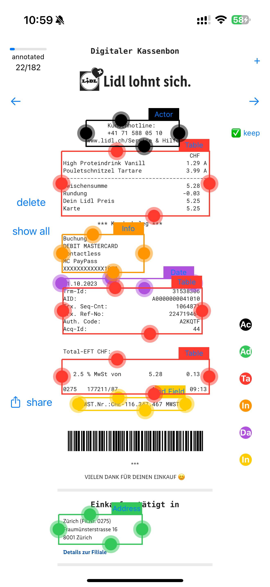

# Document Annotation Tool

*this is built to annotate lidl receipts (see Scripts on how retrieval works)*

this tool makes annotating documents easier, based on the model proposed by Saout, Lardeux, and Saubion (2024), titled "An Overview of Data Extraction From Invoices" in IEEE Access.

Each bounding box can be either:
-Actors
-Independent fields
-Info on the doc itself
-Addresses
-Tables
-Date

- **0. Focused Bounding Box:** There is an idea of the focused bounding box to help differentiate which to operate on. A single box is more prominent than the others, indicating it is the newest box added. The focus switches upon interacting with a different box.
- **1. Progress Indicator:** Shows how much has been annotated.
- **2. Navigation Arrows:** Backward and forward arrows make switching between images instant.
- **3. Delete Function:** Deletes the focused box.
- **4. Toggle Focus:** Toggles the focus to all the boxes, resulting in what's shown in the referenced figure.
- **5. Share Function:** Brings up the system sharing function to instantly share a JSON file with the annotation data.
- **6. Currently-Focused Box:** Indicates the currently-focused bounding box.
- **7. Category Buttons:** Provides a button for each box category (Actor, Address, Table, Information, Date, and Independent Field respectively).
- **8. Toggle Keeping Boxes:** Toggles the "keeping the boxes for the next image" behavior. In this case, the bounding boxes will remain in place, to be adjusted for the next picture by the user.

