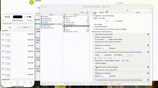

# Semi-Automatic Lidl Plus Receipt Retrieval

## Prerequisites

you need the following:

1. **Keyboard Maestro**
2. **A Mac with iPhone screen mirroring**
3. **An iPhone that supports screen mirroring**, logged into the Lidl Plus app to access the receipts.

## Instructions

 Since scrolling thru screen mirroring isn't reliable to time the movements correctly, this script automates sharing each receipt with airdrop, for every receipt in the current view. After each time the script ends, you have to manually scroll to the next batch of list items, run the script again, rinse and repeat.

### Steps:

1. **Set Up Screen Mirroring**: Make sure your iPhone is mirrored to your Mac screen through a reliable connection.
2. **Go to the "my receipts" view on the Lidl app**
3. **Run the Script**
4. **Scroll to the next**: manually scroll down on the iPhone to the next batch of receipts.
5. **Repeat**: run the script again for the new batch of receipts

**Note:** Since scrolling through screen mirroring can be unreliable for timing the movements correctly, this method requires manual intervention to scroll through the list of receipts.

